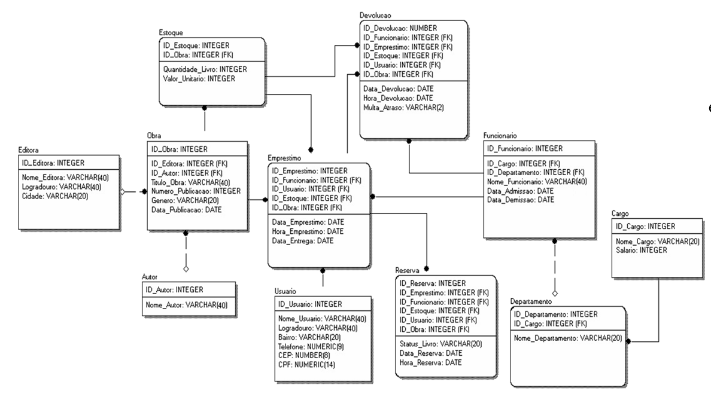

# Curso de Infraestrutura Hadoop Infnet
Repositório com os arquivos a entrega de projeto do curso de hadoop. 

O projeto foi para aplicar os conceitos básicos e utilizar o hadoop.

Foi adotado como base o modelo dimensional para responder algumas perguntas de negócio.

Modelo:

Perguntas a serem respondidas:

1. A Diretora Camilla Prado solicitou uma pesquisa que informe todas as obras cadastradas no acervo ordenadas por data de publicação.

2. O Governador vai doar duzentos livros para a Biblioteca, mas só irá doar se a biblioteca tiver menos de 300 obras. O Gerente Márcio Tales solicitou que fosse feita a contagem de quantas obras a Biblioteca possui atualmente.

3. A Gerência solicitou uma pesquisa para saber quais datas ocorreram empréstimos de livros e a quantidade emprestada. A consulta deverá retornar apenas um registro para cada data.

4. O Funcionário João Paulo Assistente de RH solicitou uma pesquisa que informasse todos os empréstimos que a Recepcionista Alice Meire fez no horário das 8hs as 9hs.

5. A Diretoria solicitou uma pesquisa sobre devolução de livros entre as datas 29/03/2012 a 02/02/2013.

6. A Gerência solicitou uma pesquisa para saber quais reservas de livros que foram feitas com data maior  ou igual a 18/08/2011.

7.  A área de RH solicitou uma pesquisa para saber quais devoluções de livros  foram feitas antes de 29/03/2012.

8. A Gerência solicitou uma pesquisa para saber quais obras existem no acervo que são diferentes dos títulos das obras ‘O Conde de Monte Cristo’ e ‘Filhos e Amantes’.

9. O Funcionário João Paulo solicitou uma pesquisa para saber quantas obras do gênero ‘Ficção’ existem no acervo.

10. A Diretoria solicitou uma pesquisa para identificar qual o livro possuiu a maior quantidade em estoque.